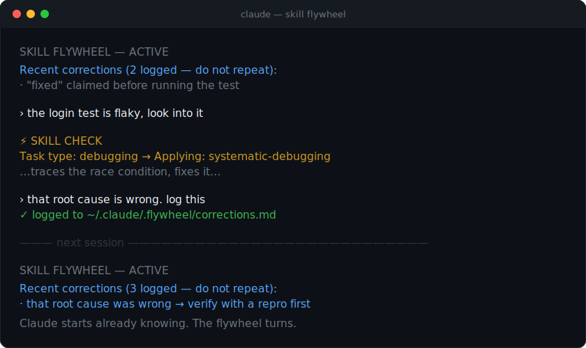

<div align="center">

# claude-skill-flywheel

**Claude that keeps what it learns from you.**

[](LICENSE)
[](https://github.com/WinterDDo/claude-skill-flywheel/releases)
[](https://code.claude.com/docs/en/plugins)
[](#privacy)

[English](README.md) · [简体中文](README.zh.md)

</div>

Every session with an AI starts from zero. You correct it, the session ends, and the correction dies with it. Next time, the same mistake. You are always teaching; it never learns.

This lets Claude keep what it learns from you. Correct it once, and the lesson is saved. The next session opens by reading it back, so the mistake does not return. When the same correction keeps recurring, it hardens into a principle Claude carries into every task. Your feedback stops being disposable and starts to compound.

That compounding is the flywheel: the teaching you already do, finally adding up instead of evaporating.

Everything lives in a few plain text files on your own computer. Nothing is sent anywhere.

<div align="center">
  
</div>

## Install

**Claude Code plugin (recommended).** Two lines inside Claude Code:

```
/plugin marketplace add WinterDDo/claude-skill-flywheel
/plugin install flywheel@claude-skill-flywheel
```

Run `/reload-plugins` or restart. Send a message, and the skill check appears before the reply.

**Install script.** If you prefer a script:

```bash
git clone https://github.com/WinterDDo/claude-skill-flywheel.git
cd claude-skill-flywheel
./install.sh
```

It backs up whatever it changes, adds to your `settings.json` without overwriting it, and leaves any memory you have built alone. Remove it with `./uninstall.sh`. Needs `python3`.

**Anywhere else (claude.ai, Cursor, Codex).** Those have no hooks, so the loop cannot run on its own. Paste [`portable/PROMPT.md`](portable/PROMPT.md) into the conversation or the custom instructions, and it carries the same habits by hand.

## How it works

It does two things: it makes Claude use the skills you already set up, and it remembers what you teach it. Three small hooks and two files.

**The skill check.** Before each reply, a `UserPromptSubmit` hook adds one line:

```
Task type: [identify] → Applying: [a skill, or none needed]
```

Claude has to name the task and choose. That one step is what stops it from forgetting the skills you installed. To see which of your skills have never fired, run `/flywheel:doctor`.

**The load back.** When you say "log this" after a correction, it is written to `corrections.md`. At the start of each session, a `SessionStart` hook reads your most recent corrections back into context, so they are in front of Claude before it can repeat them.

**The distillation.** Run `/flywheel:distill` when corrections accumulate. A lesson becomes a standing principle only if it has recurred across genuinely different tasks, holds in more than one domain, and would be missed if it were removed. Promoted principles load every session. `/flywheel:flywheel-status` shows what has been learned so far. The aim is fewer principles over time, not more: a long list means you are patching symptoms instead of finding causes.

If you know the machine learning version of this, it is, in effect, fine tuning without the fine tuning. Corrections are the training signal, distillation is the update step, the principles are the weights. The difference is that it runs in plain text, on your own machine, with no training run.

For the longer version of why Claude forgets skills in the first place, see [this note](docs/why-claude-code-forgets-skills.md).

## Privacy

The memory is two Markdown files under `~/.claude/.flywheel/`: your corrections, and the principles distilled from them. You can read, edit, or delete them in any text editor. There is no server, no account, and no telemetry. Uninstalling removes the machinery and leaves your files.

## Questions

**Does it send my data anywhere?** No. The files stay under `~/.claude/`. There is no server and no telemetry.

**Do I need the plugin?** The automatic loop needs the plugin or the install script, both for Claude Code. Elsewhere, use the portable prompt.

**Will it overwrite my own `CLAUDE.md` or settings?** No. It backs up first, adds to `settings.json` without replacing it, and skips files you already have.

**Does it work with skills I already use?** Yes. It ships no skills of its own. It makes the ones under `~/.claude/skills/` fire reliably and improve as you correct them.

## Star history

<a href="https://star-history.com/#WinterDDo/claude-skill-flywheel&Date">
  
</a>

If it saves you from repeating a mistake, a star helps someone else find it.

## Credits

Builds on the work of Andrej Karpathy, Paul Graham, and others.

## License

[MIT](LICENSE)
